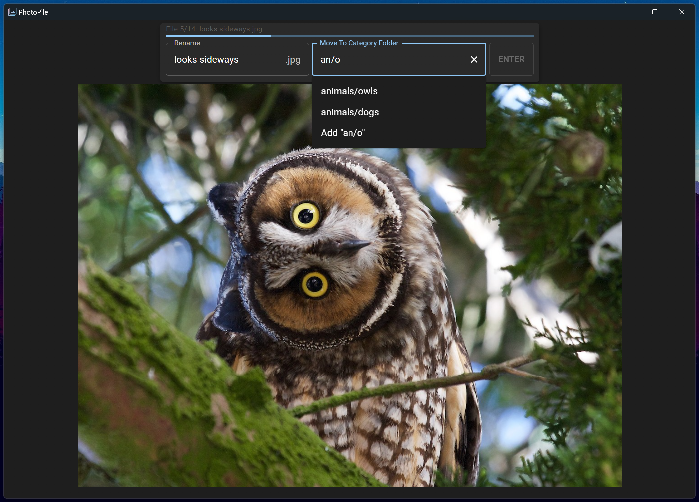

# photopile

Photopile is an app I made to help sort all the images and memes on my compute. Open a folder of images in Photopile, and you can quickly rename and sort them into categories.

Photopile is an Electron app made using React and Electron-Forge. To use it, clone the repo and run `npm run make` to generate an installer for your platform.

# categories

A "category" in photopile is a folder that an file will be moved to. Categories can be hierarchical, e.g. `animals` and `animals/owls`. The category selection box will autosuggest any already-existing folders and subfolders of your selected directory.

You can use fuzzy-find to quickly specify a file. For example, if you have the categories `animals/dogs`, `animals/cats`, and `memes/cats`, just type `ac` and `animals/cats` will be the first autosuggestion.

To create a new category folder, type a category that does not fuzzy-match any existing folder, or select the "Add \<category>" option in the dropdown.

# keyboard shortcuts

You can quickly sort through a pile of photos without taking your fingers off the keyboard. Tab to advance between the name field, category field, and enter button.
- on the name field, tab accepts the current file name
- on the category field, tab accepts the current autocomplete suggestion
- the enter button accepts the specified name, moves the file to the specified category folder, and advances to the next file in the queue.
